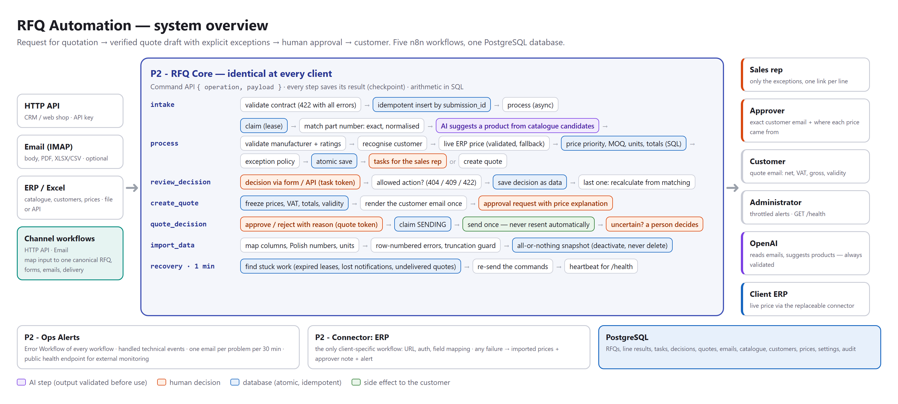
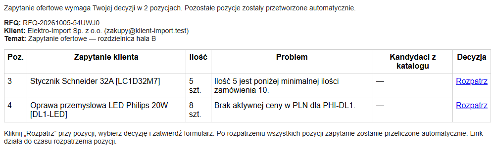
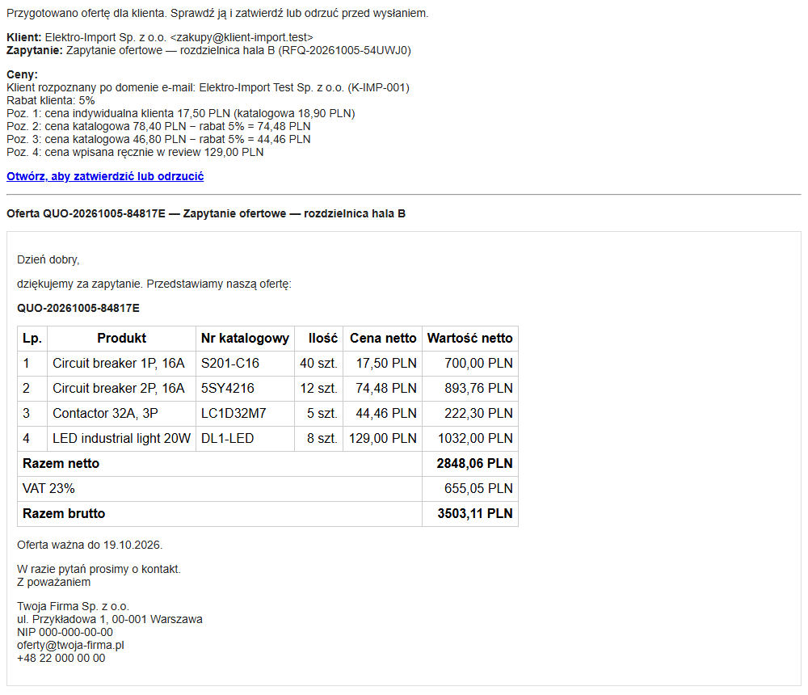
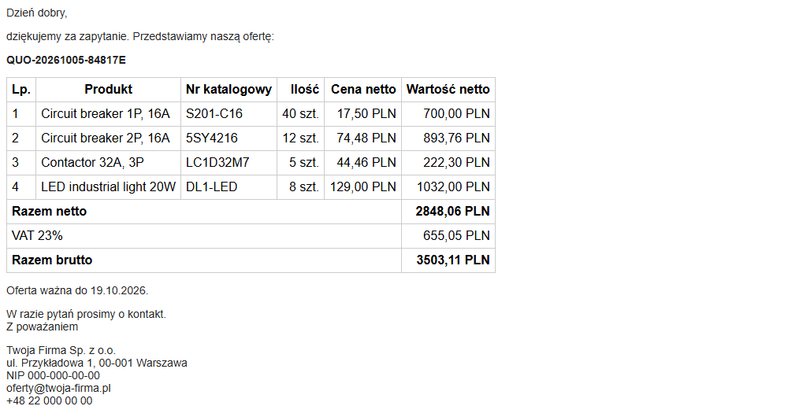

# RFQ Automation — request for quotation → verified quote

An n8n + PostgreSQL product for electrical and technical distributors: incoming requests for quotation (email, PDF, spreadsheets, API) become a **verified quote draft** plus an **explicit list of what could not be decided safely**. Sales reps handle only the exceptions; nothing reaches a customer without a person's approval.

*Purple = AI step (always validated), orange = human decision, blue = database, green = customer-facing side effect.*

## Problem

A sales rep retypes line items from an email, looks every product up by part number, checks the price list, the customer's discount and minimum order quantities, adds everything up and writes the quote. It takes hours every day — and a wrong part number or price costs margin or the customer.

## Solution

1. **Intake** — email (body, PDF with a text layer, XLSX/CSV attachments) or HTTP API from a CRM / web shop; every request gets an ID and duplicates are recognised.
2. **AI reads the email** into a strict schema; every extracted value must occur in the message (grounding), otherwise the whole message goes to a person.
3. **Matching** by part number (exact and normalised). No part number → the LLM may suggest a product **only from catalogue candidates**, and a person confirms it.
4. **Pricing by rules, not by AI** — live ERP price (optional), customer price, customer discount, price list, MOQ and units; all arithmetic in SQL.
5. **Exceptions go to the sales rep** by email, one link per line; after the last decision the request is recalculated automatically.
6. **Quote approval** — the approver sees the exact customer email and where every price came from; one click sends it.

## Demo

A request with four lines from a recognised customer: two lines are priced automatically (customer price, customer discount), two need a decision.

**1. The sales rep gets only the exceptions** — quantity below the minimum order, product without a price:

**2. The approver sees the exact customer email and an explanation of every price:**

**3. The customer receives the approved quote** — net prices only, totals and VAT calculated in the database:

## Architecture

Five n8n workflows around one PostgreSQL database: a **core identical for every client** (six operations + recovery), channels for HTTP API and email, ops alerts with a health endpoint, and an optional **ERP connector** — the only client-specific piece.

| Workflow | Role |
|---|---|
| [`rfq-core.json`](workflow/rfq-core.json) | intake, processing (matching, AI suggestion, customer, ERP price, pricing rules, exceptions), review decisions, quote creation and decisions, data import, recovery |
| [`channel-http-api.json`](workflow/channel-http-api.json) | RFQ API with API key, review and quote decisions, data import API and upload form |
| [`channel-email.json`](workflow/channel-email.json) | IMAP intake and LLM extraction, reviewer emails and forms, quote approval page, customer delivery |
| [`ops-alerts.json`](workflow/ops-alerts.json) | error workflow, throttled admin alerts, `/health` endpoint |
| [`connector-erp.json`](workflow/connector-erp.json) | template for the live price check against the client's ERP |

More in the docs:

| | |
|---|---|
| [architecture](docs/architecture.md) | diagrams, operations, AI vs deterministic logic, reusable core vs vertical vs client configuration, the real core canvas |
| [decisions](docs/decisions.md) | 22 design decisions with the trade-offs accepted |
| [data model](docs/data-model.md) | tables, constraints, status flows |
| [testing](docs/testing.md) | 27 end-to-end regression tests, failure paths, known gaps |

## Reliability

- **Idempotent everywhere** — repeated API calls, emails delivered twice and simultaneous "approve" clicks never create two quotes or two customer emails.
- **Self-healing** — leases and a recovery schedule resume interrupted work from the last checkpoint; the LLM is never called twice for the same input.
- **Never resends to a customer automatically** — an uncertain delivery is a decision for a person.
- **Business exceptions ≠ technical errors** — the first become tasks for sales, the second throttled alerts for the administrator.
- **Secure by default** — API key (stored as a hash) plus a per-task / per-quote token for every decision; email link scanners cannot trigger actions.

## Product package

The installable product (not in this repository) adds a Docker Compose installer that keeps workflow and credential IDs and updates installations in place, numbered database migrations verified by a fresh-install test, client documentation in Polish (installation, configuration, business rules, troubleshooting, security/GDPR) and the regression suite described in [testing](docs/testing.md).

## Built with

n8n · PostgreSQL · OpenAI structured outputs with deterministic validation · Docker Compose · Node.js tooling.
