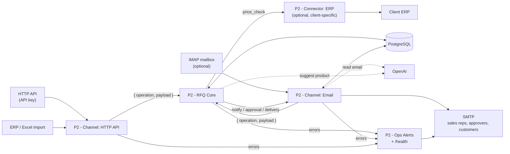
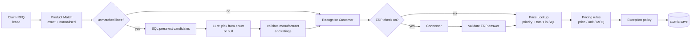

# Architecture

*System overview: inputs → channels → the core and its six operations → people and systems. Purple = AI step (validated before use), orange = human decision, blue = database, green = side effect to the customer.*

## System context

## Workflows

| Workflow | Role | Nodes |
|---|---|---|
| **P2 - RFQ Core** | identical at every client; command API with six operations + a recovery schedule | ≈120 |
| **P2 - Channel: HTTP API** | RFQ intake, review and quote decisions (API key), data import API and upload form | ≈40 |
| **P2 - Channel: Email** | IMAP intake and LLM extraction, reviewer emails and forms, quote approval page, customer delivery, email recovery | ≈110 |
| **P2 - Ops Alerts** | Error Workflow of all others, handled ops events, throttled admin email, `GET /webhook/health` | 14 |
| **P2 - Connector: ERP** | template for the live price check against the client's ERP (URL, auth, field mapping) | 5 |

Workflows call each other by ID (channel → core, core → channel from settings, all → Ops Alerts as Error Workflow); the installer keeps these IDs ([D20](decisions.md)).

### Core operations

| Operation | Input | What happens |
|---|---|---|
| `intake` | canonical RFQ | contract validation (422 with all errors) → idempotent insert by `submission_id` → `process` asynchronously |
| `process` | `{ rfq_id }` | lease → part-number matching (exact, normalised) → LLM suggestion for unmatched lines (optional) → customer recognition → live ERP price (optional) → pricing rules → exception policy → atomic save → reviewer notification or `create_quote` |
| `review_decision` | task id + token + action | validation → 404/409/422 → atomic save of the decision as data → when no open tasks remain: `process` again |
| `create_quote` | `{ rfq_id }` | one query: quote with frozen prices, VAT, totals, validity, approval level → approval request |
| `quote_decision` | quote id + token + action | status-dependent rules (approve / reject with reason / mark sent / resend) → delivery |
| `import_data` | kind + rows | column mapping, Polish number formats, units, row-numbered errors, deactivation limit → all-or-nothing apply → audit |
| recovery (schedule) | — | one query lists stuck work, one loop re-sends the commands; heartbeat for `/health` |

### Processing pipeline

## AI vs deterministic logic

| Step | AI | Deterministic |
|---|---|---|
| Reading an email (body, PDF text, spreadsheet) | extracts lines into a strict JSON schema | grounding: every value must occur in the source; unit alias table; customer from the header; line numbers by code; reject whole message when unsure |
| Matching a product | proposes one SKU **from a candidate list** for lines without a part number (or `null`) | exact and normalised part-number match; candidate preselection in SQL; manufacturer/rating check; a person confirms |
| Prices, discounts, totals, VAT | — | SQL `numeric`, price priority, MOQ, unit rules |
| Commercial decisions | — | exception policy with allowed actions; human approval before sending |

## Reusable core vs vertical vs client configuration

| Layer | Where | Examples |
|---|---|---|
| Reusable core | `P2 - RFQ Core`, Ops Alerts, migrations | canonical RFQ, idempotency, leases and recovery, exception → task → resume, quote freezing, approval, audit |
| Vertical (electrical distribution) | catalogue model, matching rules | part-number normalisation, manufacturer + rating validation (A, W, kW, V, P, mm²), units and MOQ |
| Client configuration | `app_settings`, imported data, channels, ERP connector | recipients, seller data, VAT, approval threshold, texts and language, column aliases, catalogue, customers and prices, which channels are installed |

## The real core canvas

*`P2 - RFQ Core` as built in n8n — 112 nodes with their real positions, connections and sections, rendered from the workflow export [`workflow/rfq-core.json`](../workflow/rfq-core.json) at high resolution — open the image and zoom in (a screenshot of the whole canvas would be unreadable).*

## Repository layout

| Path | Contents |
|---|---|
| `workflow/` | n8n exports of the five workflows (no credentials or secrets) |
| `docs/` | architecture, [decisions](decisions.md), [data model](data-model.md), [testing](testing.md) |
| `screenshots/` | system overview, the rendered core canvas, demo screenshots |

The installable product package (installer, database migrations, client documentation, regression suite) is not part of this repository.
