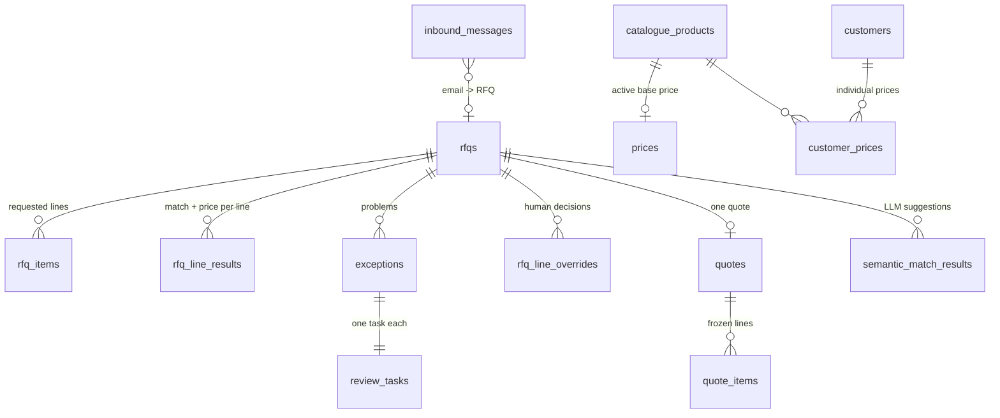
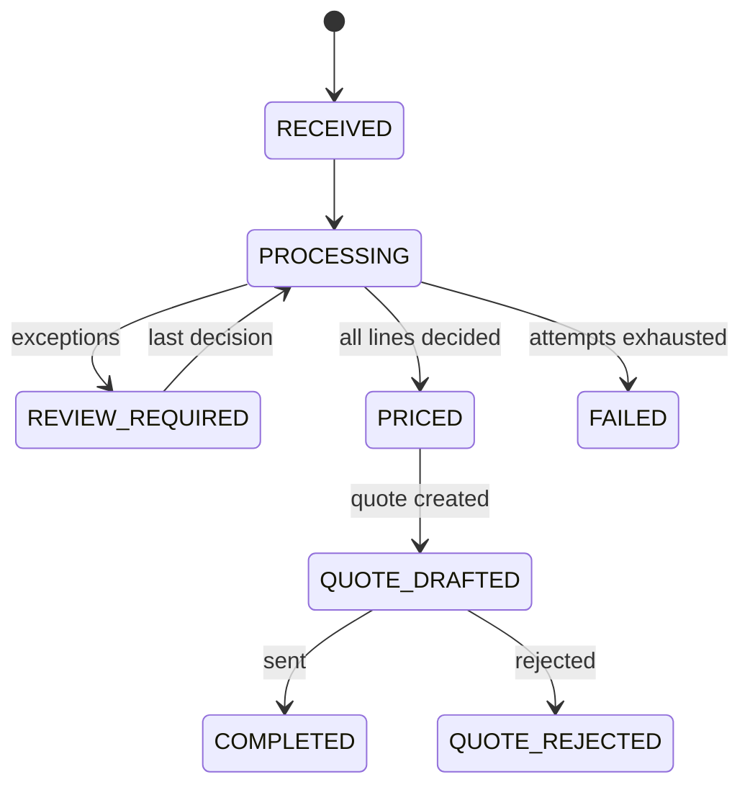
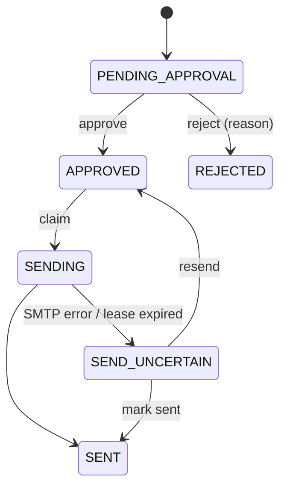

# Data model

PostgreSQL holds all business state; n8n execution history is only for debugging ([D6](decisions.md)). The schema is delivered as numbered migrations, each applied once in order (verified by a fresh-install test).

## Requests and processing

| Table | Key columns | Notes |
|---|---|---|
| `rfqs` | `rfq_id`, `submission_id` (unique = idempotency key), `status`, customer name/email, `customer_code`, `customer_match`, `processing_attempts`, `processing_started_at` (lease), `last_error` | one row per request |
| `rfq_items` | `rfq_id`, `line_number`, `raw_description`, `part_number`, `quantity`, `unit` | the request as received; never modified |
| `rfq_line_results` | `match_status`, `match_method`, `sku`, `match_candidates`, `pricing_status`, `unit_price`, `line_total`, `pricing_source`, `list_unit_price`, `discount_percent`, `erp_price_status`, `synced_unit_price` | latest calculation per line; `line_total` only when `VALID` (`CHECK`) |
| `exceptions` | `type`, `severity`, `status` | one `OPEN` exception per line and type (partial unique index) |
| `review_tasks` | `review_type`, `payload` (candidates, details, `allowed_actions`), `status`, `resolution`, `resolved_by`, `access_token`, `notified_at` | created in the same transaction as its exception |
| `rfq_line_overrides` | `sku`, `unit_price`, `accept_below_moq`, `unavailable` | human decisions stored as data and applied on recalculation |
| `semantic_match_results` | `suggested_sku`, `status`, `reason`, `candidates`, `validation_errors`, `llm_usage` | LLM suggestion checkpoint — asked once per line |

## Quotes

| Table | Key columns | Notes |
|---|---|---|
| `quotes` | `quote_id`, `status`, `subtotal_net`, `vat_rate`, `vat_amount`, `total_gross` (`CHECK` gross = net + VAT), `valid_until`, `approval_level`, `access_token`, `customer_subject/html/text` (rendered once), `decided_by`, `rejection_reason`, `send_attempted_at`, `sent_at` | one per RFQ (unique `rfq_id`) |
| `quote_items` | `unit_price`, `line_total`, `status` (`QUOTED` has a price, `UNAVAILABLE` has none — `CHECK`), `pricing_source`, `list_unit_price`, `discount_percent`, `erp_price_status` | prices frozen at creation |

## Email intake

| Table | Key columns | Notes |
|---|---|---|
| `inbound_messages` | `message_id` (unique), `status`, `source_text` (body + attachment text), `attachments` (metadata only), `extraction` (LLM output), `validation_errors`, `llm_model`, `llm_usage`, `extraction_attempts`, `rfq_id` | checkpoint per step; attachments themselves are not stored |

## Client data

| Table | Key columns | Notes |
|---|---|---|
| `catalogue_products` | `sku`, `manufacturer`, `part_number`, `normalized_part_number` (generated by `normalize_part_number()`), `description`, `unit`, `status` | deactivated, never deleted |
| `prices` | `product_id`, `unit_price` (> 0), `currency`, `unit`, `min_quantity`, `source` | one active price per product (partial unique index) |
| `customers` | `customer_code`, `emails` (addresses and `@domains`, GIN index), `discount_percent`, `active` | |
| `customer_prices` | `customer_code`, `product_id`, `unit_price`, `currency`, `status` | |
| `import_batches` | `kind`, `source`, `filename`, `content_hash`, `status` (`APPLIED` / `REJECTED`), `errors`, `summary` | audit of every import |

## Configuration and operations

| Table | Notes |
|---|---|
| `app_settings` | client configuration as `key → jsonb` with a description (recipients, seller, VAT, texts per language, unit and column aliases, workflow IDs, API key hash) |
| `technical_errors` | every technical problem with fingerprint and whether an alert email was sent |
| `system_heartbeats` | last run of each recovery schedule (`/health`) |
| `schema_migrations` | applied migrations with checksums (created by the installer) |

## Status flows

